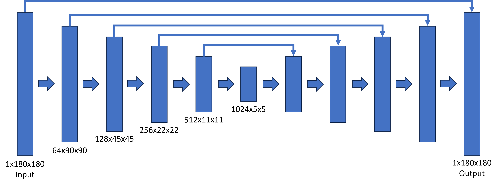
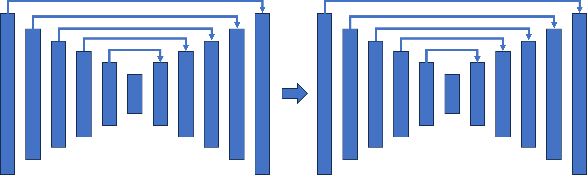
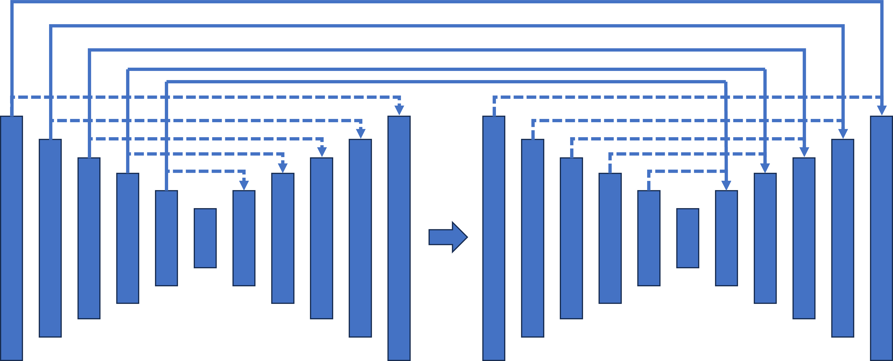

# KAIST-MNIST-restoration
This repository contains the implementation of three U-Net-based architectures for the restoration of damaged fingerprints. The project explores learning-based methods to address the challenge of restoring altered fingerprints, which are often modified to evade identification.

These models were developed as part of the research paper [Investigation of Connected U-Net Architectures for Damaged Fingerprint Restoration](https://github.com/jayanpatel789/KAIST-MNIST-restoration/blob/main/Investigation%20of%20Connected%20U-Net%20Architectures%20For%20Damaged%20Fingerprint.pdf). Fingerprints altered through methods such as obliteration, Z-cuts, and central rotations pose challenges for identification systems. The goal of this project was to evaluate the effectiveness of three different U-Net configurations—single U-Net, double U-Net, and connected U-Net—in restoring these altered fingerprints.

This project was completed between 3rd July 2023 and 5th August 2023.

This project was done in collaboration with the Neuro-Machine Augmented Intelligence Lab at KAIST as part of the KISS 2023 program.

## Dataset
The dataset used for this project wsa the SOCOFing dataset, which can be downloaded [here](https://www.kaggle.com/datasets/ruizgara/socofing).

## Models
### Single U-Net

The baseline architecture for fingerprint restoration.

### Double U-Net

Two standard U-net architectures connected in series.

### Connected U-Net

Two standard U-net architectures connected in series. The feature maps from the first U-net are stored and passed into the second U-net during the decoding phase.

Each folder contains the U-Net parts, model classes, dataloader, training and testing programs.
